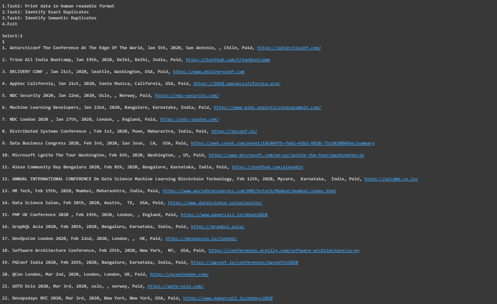
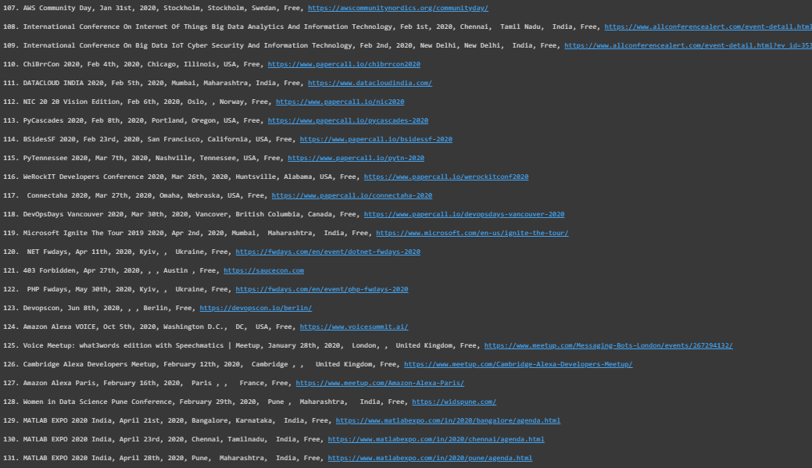
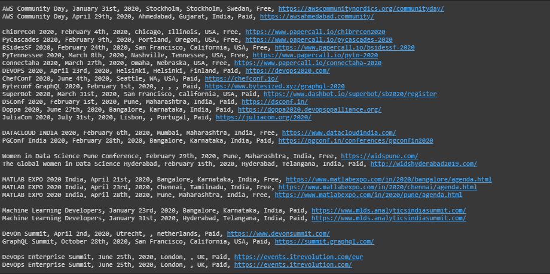

# Konfhub-backend

## Installing
* Clone repo using ```https://github.com/mornville/Konfhub-backend.git```
* ```cd Konfhub-backend```
* Set up virtual environment
* Install requirements - ```pip install requirements.txt```

## Running
* ```python main.py```

#### Task 1
To create human readable list of events




#### Task 2
To identify the events which are complete duplicates


#### Task 3
To identify events which are semantically similar


